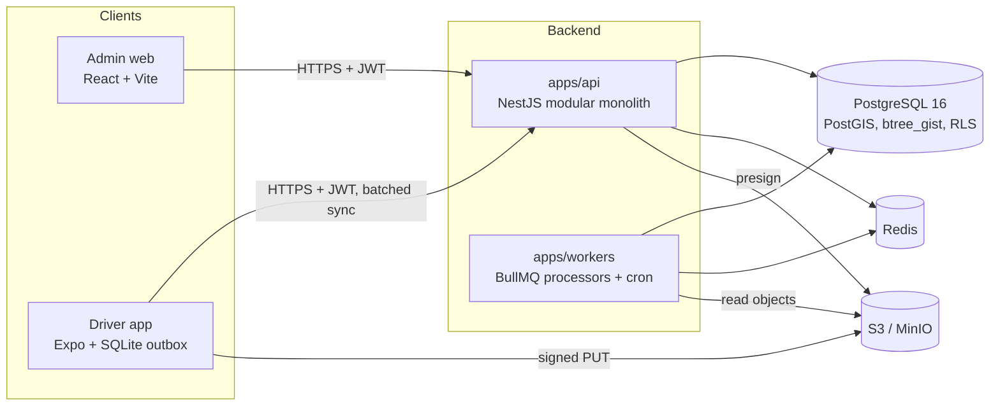
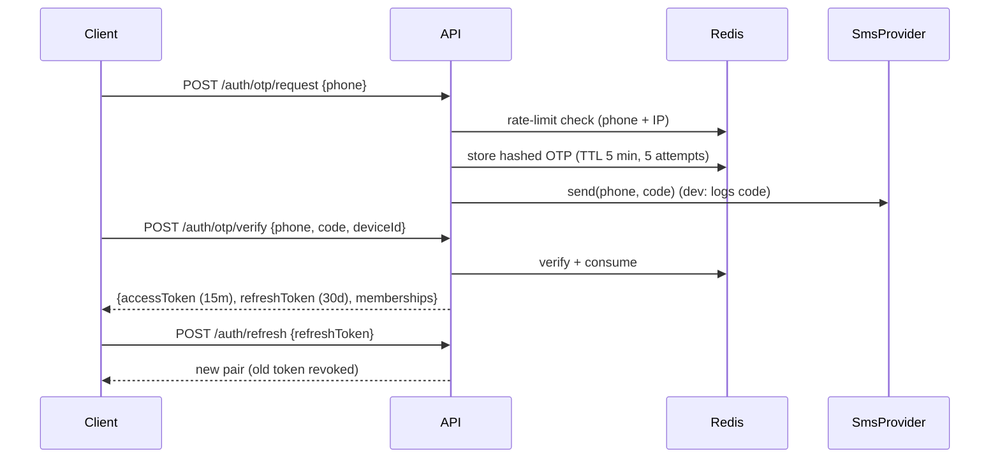

# Architecture

## Overview



`apps/api` and `apps/workers` are built from the same codebase and share modules, repositories and `libs/domain`. They are separate processes so that slow work (OCR, cycle recomputation, PostGIS distance) never blocks requests and can scale on its own.

## API modules

| Module | Owns |
| --- | --- |
| `identity` | Users, OTP login, JWT access/refresh, organizations, memberships, roles, devices |
| `media` | Signed upload URLs, media metadata, upload confirmation, OCR results |
| `fleet` | Vehicles, vehicle models, drivers, documents, expiry alerts |
| `trips` | Trips, state machine transitions, `trip_events`, odometer readings, trip charges |
| `fuel` | Fuel fills, fuel cycles, per-vehicle baselines |
| `telemetry` | GPS ingest, partition maintenance, trip distance checks |
| `money` | Collections, daily settlements |
| `alerts` | Alerts inbox and review queue |
| `platform` | Config, logging, health, Sentry, Prisma (via `libs/db`), tenancy, idempotency, outbox |

Modules talk to each other through exported services, never through each other's repositories. Cross-module side effects (for example "a fill was recorded, so recompute cycles") go through the outbox, so they're asynchronous and retryable.

## Layering

```
HTTP ─▶ Controller ─▶ Service ─▶ Repository ─▶ Postgres
         (Zod parse)   │  (tx, orchestration)  (Prisma, tenant-scoped) 
                       └─▶ libs/domain (pure functions, no I/O)
```

- **Controllers** parse input with `libs/contracts` schemas, call one service method and map the result to a response. No business logic.
- **Services** open transactions, load data through repositories, call domain functions, persist results and write outbox events.
- **Repositories** are the only code that touches Prisma (`libs/db`), including TypedSQL for PostGIS. They get the tenant from the request context, so callers can't forget it, and convert `bigint` paise to `number`.
- **`libs/domain`** takes plain data and returns plain data: easy to unit-test, reusable on the client (for example, the driver app runs the trip state machine offline).

## Multi-tenancy

Every user belongs to one or more organizations through `memberships`, each with a **set** of roles (`owner`, `manager`, `driver`). A DCO is an org of one whose membership has both `owner` and `driver`.

Enforcement has three layers, so that missing one doesn't leak data:

1. **Guard.** It verifies the JWT, loads the membership for the token's `org_id` claim, checks the route's required roles, and stores `{ userId, orgId, roles }` in AsyncLocalStorage.
2. **Repository.** The base repository reads `orgId` from context and adds it to every query and insert. Running a query without a tenant context throws.
3. **Postgres RLS.** Every org-scoped table has a policy `org_id = current_setting('app.org_id')::uuid`. The API connects as a non-owner role. A Prisma client extension wraps each operation in a transaction that first runs `set_config('app.org_id', …, true)`. Workers process one org per job via `withOrg(orgId, fn)`.

   This costs one extra round trip per standalone query. If profiling shows that matters, RLS can be turned off for reads with a flag while keeping layers 1–2.

Switching orgs is an explicit call that issues a new token pair for the target org.

## Authentication



- Refresh tokens are stored **hashed** and rotated on every use. Presenting an already-rotated token revokes the whole token family, which detects stolen tokens.
- OTP limits: 3 requests per 10 minutes and 10 per day per phone, plus a per-IP limit.

## Background jobs

| Queue / job | Trigger | Work |
| --- | --- | --- |
| `outbox-relay` | Polls `outbox` (every second) | Publishes committed events to BullMQ |
| `ocr` | `media.uploaded` (odometer, receipt) | Runs `OcrProvider` and stores the result; a mismatch creates a review item |
| `fuel-cycles` | `fuel.fill_recorded` / `fuel.fill_voided` | Recomputes the vehicle's cycles and baseline from the affected fill onward |
| `trip-distance` | `trip.ended`, late GPS batch for an ended trip | PostGIS distance, coverage, odometer-vs-GPS verdict |
| `document-expiry` | Cron, 06:00 IST daily | Raises 30/7/1-day and expired alerts (deduplicated) |
| `gps-partitions` | Cron, daily | Creates the next 2 monthly partitions; drops partitions past retention |
| `idempotency-gc` | Cron, daily | Deletes idempotency keys older than 30 days |

All job payloads are Zod-validated. Every job is idempotent: retries and duplicate deliveries are safe.

### Why a transactional outbox

Calling BullMQ directly from a service either enqueues jobs for transactions that later roll back, or loses jobs when the process dies after commit. Instead, services insert into `outbox` in the same transaction, and the relay publishes after commit.

## Idempotency and offline sync

The driver app writes everything to local SQLite and an outbox table first. A sync engine replays the outbox in order when online.

- **Records the app creates** (fuel fills, collections, media, GPS points, trip events) use the **client-generated UUID as their primary key**.
  - Re-sending the same id with the same payload returns the original result (`200`, plus the header `Idempotent-Replay: true`).
  - Re-sending the same id with a different payload returns `409 IDEMPOTENCY_CONFLICT`.
- **Commands** (trip transitions) carry an `Idempotency-Key` header. The response is stored in `idempotency_keys` with a hash of the request, and a replay returns the stored response.
- **Conflicts resolve deterministically, and the server wins:**
  - **A trip was cancelled on the server, then started offline.** The start is rejected with `409 TRIP_CANCELLED`. The app marks the trip cancelled and shows a notice. The odometer photo is still uploaded and kept as orphan evidence for review.
  - **A trip was reassigned while the driver was offline.** Writes from the old driver are rejected with `409 TRIP_REASSIGNED`.
  - **A fuel fill or collection arrives late.** It's always accepted, because it's a fact that happened. If its day is already settled, it's carried into the next settlement as an adjustment.
- The app stores both times: `occurred_at` (device clock, used for business logic) and `recorded_at` (server clock, for audit). A device clock more than 10 minutes off creates a review item.

## Observability

- **pino** JSON logs, one line per request, with `requestId` (from `X-Request-Id` or generated), `orgId`, `userId`, route, status and latency. PII (phone numbers, OTPs) is redacted outside dev.
- `GET /health/live` (process up) and `GET /health/ready` (Postgres, Redis, S3 reachable).
- **Sentry** for API and workers, enabled when `SENTRY_DSN` is set. The request ID and org ID are attached as tags.

## Provider interfaces

| Interface | Stub | Real (later) |
| --- | --- | --- |
| `SmsProvider` | `ConsoleSmsProvider` logs the OTP | MSG91 / Gupshup etc. (DLT-registered template) |
| `OcrProvider` | `StubOcrProvider` returns configured values or "unreadable" | Cloud OCR or an on-device model |
| `MapsProvider` | `StubMapsProvider` (geocode returns null; route distance uses haversine) | Google / Mapbox / Ola Maps |
| `PaymentsProvider` | not needed in Phase 1 | UPI collect / payment links |

Providers are chosen by env var and injected by Nest DI. Tests swap in fakes.
