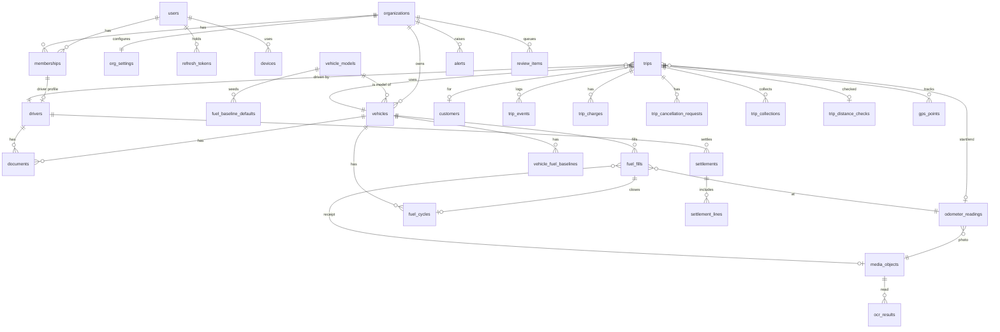

# Database

PostgreSQL 16 with the `postgis` and `btree_gist` extensions, accessed through **Prisma** (decision D1). The full proposed DDL is in [`design/schema.sql`](design/schema.sql). Once M0.2 lands, `libs/db/prisma/schema.prisma` and the migrations in `libs/db/prisma/migrations` become the source of truth and this page describes them.

## Conventions

| Rule | Detail |
| --- | --- |
| Primary keys | `uuid`. Server-created rows use UUIDv7 generated in the app. Rows created on the driver app use the client's UUID, which doubles as the idempotency key. |
| Tenancy | Every org-scoped table has `org_id`, an index on it, and an RLS policy. |
| Money | `bigint` paise, with a `CHECK (>= 0)` where negative values make no sense. |
| Time | `timestamptz` (UTC). Calendar dates such as `expires_on` and `business_date` are `date` values in IST. |
| Quantities | Fuel in integer **milli-units**: millilitres for petrol/diesel, grams for CNG. Odometer in integer km. |
| Derived data | Fuel cycles and distance checks are recomputed and versioned (`superseded_at`), never edited in place. |
| Enums | Postgres enums. New values are added with `ALTER TYPE … ADD VALUE`; values are never removed. |

## Prisma notes

Prisma doesn't model several Postgres features this schema relies on. The rules:

| Feature | How it's handled |
| --- | --- |
| PostGIS `geography(Point,4326)` columns | Declared as `Unsupported("geography(Point, 4326)")?` in `schema.prisma`, so the Prisma client can't read or write them. All spatial reads and writes go through **TypedSQL** (`libs/db/prisma/sql/*.sql`), wrapped by repositories, so services never see raw SQL. |
| Generated `trips.busy_window` | `Unsupported("tstzrange")?`; the expression is added by hand in the migration |
| Exclusion constraints, partial unique indexes, CHECKs | Added by hand to migrations created with `prisma migrate dev --create-only` |
| `gps_points` partitioning + partitions | Hand-written migration; partitions created at runtime by the `gps-partitions` cron |
| RLS policies and the app role | Hand-written migration |
| Drift protection | CI applies all migrations to a fresh DB, then runs `prisma migrate diff --from-migrations … --to-schema-datamodel …`. Any generated statement fails the build, which catches a future migration silently dropping hand-written objects. |
| `bigint` paise | Prisma returns JS `bigint`. Repositories convert to `number` (safe below 2^53 paise) so that contracts and JSON never carry `bigint`. |
| RLS context | A Prisma client extension runs each operation inside a transaction that first calls `set_config('app.org_id', $orgId, true)`. Services that already open a transaction set it once for the whole transaction. |
| Shared client | `libs/db` exports the Prisma client factory, TypedSQL queries and generated types; `apps/api` and `apps/workers` both depend on it. Only repositories import it (enforced by an ESLint boundary rule). |

## Entity relationships

## Table reference

### Identity
| Table | Purpose |
| --- | --- |
| `users` | One row per phone number (E.164). Future passengers are users with no membership. |
| `organizations` | A fleet or a DCO (`kind`). |
| `org_settings` | Typed audit thresholds: k-sigma, minimum cycles, percent fallback, EWMA α, odometer-vs-GPS tolerance, document alert days, default driver pay rule. |
| `memberships` | User ↔ org, with `roles membership_role[]`. |
| `devices` | Installation IDs from the driver app; referenced by media evidence. |
| `refresh_tokens` | Hashed, rotated, grouped by `family_id` for reuse detection. |

OTP challenges and rate-limit counters live in Redis, not Postgres.

### Fleet
| Table | Purpose |
| --- | --- |
| `vehicle_models` | Make, model and fuel type. Global rows (`org_id IS NULL`) or org-specific overrides. |
| `fuel_baseline_defaults` | Seed value (and std dev) per model + audit track, or per track only: km/L, km/kg, or paise/km for `bifuel_cost`. The most specific match wins: org + model, then global + model, then global fuel-only. |
| `vehicles` | Registration unique per org; required `fuel_type`. |
| `drivers` | Driver profile per org, 1:1 with a membership that has the `driver` role. `pay_rule` optionally overrides the org's driver pay rule. |
| `documents` | RC / insurance / permit / PUC on a vehicle, or DL on a driver (enforced by CHECK). Renewing a document sets `superseded_by` on the old row. |

### Evidence
| Table | Purpose |
| --- | --- |
| `media_objects` | Client UUID, storage key, SHA-256, capture time, GPS, accuracy, mock flag, device, upload status. |
| `ocr_results` | OCR output per media object, from a given provider. |
| `odometer_readings` | Typed km + OCR km + photo. Shared by trip start/end, fuel fills and ad-hoc readings. |

### Trips
| Table | Purpose |
| --- | --- |
| `customers` | Org-scoped booking contact; `user_id` is for future passenger accounts. |
| `trips` | Type, status, channel, from/to (text + `geography(Point)`), schedule, vehicle, driver, quoted fare, start/end odometer, cancellation fields, `version`. |
| `trip_events` | Append-only log of every transition: actor, role, `occurred_at`, `recorded_at`, payload. `(trip_id, seq)` is unique. |
| `trip_cancellation_requests` | Reason + end odometer from the requester, approval/rejection by an owner or manager. At most one `pending` request per trip. |
| `trip_charges` | Toll, parking, state tax, driver allowance, night charge, extra km. Records who entered each charge and whether the driver paid it. Voidable before settlement. |

**Double-booking protection.** `busy_window` is a generated `tstzrange(scheduled_start_at, scheduled_end_at)`. Two exclusion constraints (`btree_gist`) stop a vehicle, or a driver, from being on two `assigned`/`started` trips whose windows overlap. The API maps a violation to `409 VEHICLE_BUSY` / `DRIVER_BUSY`.

### Fuel
| Table | Purpose |
| --- | --- |
| `fuel_fills` | Client UUID, vehicle, driver, fuel actually filled, `quantity_milli`, `cost_paise`, odometer, `is_full_tank`, receipt, `paid_by`, `voided_at`. |
| `fuel_cycles` | One row per full→full cycle: audit track, distance, fuel (NULL for bi-fuel), cost, metric (`km_per_unit` or `paise_per_km`) and value, the baseline snapshot used, method, deviation, verdict. Recomputation sets `superseded_at` on old rows. |
| `vehicle_fuel_baselines` | Current EWMA mean, variance and cycle count per (vehicle, audit track). |

### Telemetry
| Table | Purpose |
| --- | --- |
| `gps_points` | `PARTITION BY RANGE (recorded_at)`, monthly, with a `DEFAULT` partition. The PK `(recorded_at, client_point_id)` dedupes re-sent batches. |
| `trip_distance_checks` | Odometer km, GPS km, points used/total, maximum gap, coverage, verdict. |

Partitions are named `gps_points_YYYY_MM`. The `gps-partitions` cron keeps two months ahead and drops partitions older than `GPS_RETENTION_MONTHS`.

### Money
| Table | Purpose |
| --- | --- |
| `trip_collections` | Client UUID; cash / UPI / card amounts per trip. |
| `settlements` | One per (org, driver, IST business date). Holds totals and net payable; `draft` → `settled`. |
| `settlement_lines` | What went into a settlement. `UNIQUE (ref_type, ref_id)` guarantees each trip, fill or collection is settled exactly once. |

### Alerts and review
| Table | Purpose |
| --- | --- |
| `alerts` | Severity, title, plain-language `explanation`, linked subject, `dedupe_key` unique per org. |
| `review_items` | Items needing a human decision: OCR mismatch, odometer regression, implausible efficiency, mock location, orphan evidence. |

### Infrastructure
| Table | Purpose |
| --- | --- |
| `idempotency_keys` | Stored responses for command endpoints; garbage-collected after 30 days. |
| `outbox` | Domain events written in the business transaction and relayed to BullMQ. |

## Future-proofing

Planned features add tables and nullable columns. None of them rewrites existing data.

| Feature | Expected change |
| --- | --- |
| Passenger app | Passengers are `users` without memberships; `customers.user_id` links bookings; `booking_channel` gets `passenger_app`. |
| Return-leg matching | Nullable `trips.return_leg_of`; a new `leg_offers` table. Uses the existing PostGIS points and `busy_window`. |
| OTA partner API | A `partners` table, nullable `trips.partner_id` / `partner_booking_ref`, `booking_channel` gets `ota_partner`, API keys are scoped to a partner. |
| Payments | A `payments` table referencing collections; no changes to settlement math. |
