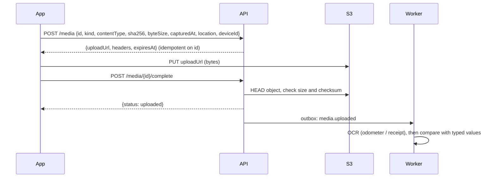

# Evidence and anti-tampering

## Capture rules (driver app)

- Odometer and receipt photos can **only** be taken with the in-app camera (`expo-camera`). There's no gallery picker.
- At capture, the app records `capturedAt` (device clock), GPS (lat, lng, accuracy), expo-location's `mocked` flag, the device install id, and the SHA-256 of the JPEG bytes.
- The photo and its metadata go to local SQLite and the outbox immediately. Uploading happens whenever the device is online.

## Upload flow



- Signed URLs are short-lived (10 minutes by default), limited to a single key, and pinned to the declared content type and SHA-256 checksum. If a URL expires while the device is offline, the app simply asks for a new one; the request is idempotent on the media id.
- An object that fails verification is marked `rejected`, and a review item is created.

## Server-side plausibility checks

Client metadata can be forged on a rooted phone, so the server cross-checks it. Each failed check creates a **review item**; none of them blocks the driver.

| Check | Review item |
| --- | --- |
| Capture GPS is flagged as mock | `mock_location` |
| Device clock differs from server time by more than 10 minutes (when sent online) | `clock_skew` |
| An odometer photo for a trip start was captured more than 2 km from the trip's `from_point` | `ocr_mismatch_odometer` (context: location) |
| OCR km differs from typed km by more than 1 km, or the photo is unreadable | `ocr_mismatch_odometer` |
| Receipt OCR amount differs from typed cost by more than ₹10 | `ocr_mismatch_receipt` |

Hardware-backed attestation (Play Integrity / App Attest) is the real fix and is out of scope for Phase 1.

## OCR

`OcrProvider` interface:

```ts
interface OcrProvider {
  readOdometer(image: ImageRef): Promise<OcrResult<{ km: number }>>;
  readFuelReceipt(image: ImageRef): Promise<OcrResult<{ amountPaise?: number; quantityMilli?: number }>>;
}
type OcrResult<T> =
  | { status: 'ok'; value: T; confidence: number; raw: unknown }
  | { status: 'unreadable' | 'error'; reason: string };
```

The stub provider returns deterministic values (configurable in tests) so the mismatch → review-item path can be exercised end to end.

## Review queue

Owners and managers resolve each item with one of:

| Resolution | Effect |
| --- | --- |
| `accepted_typed` | The typed value stands |
| `accepted_ocr` | The OCR value replaces the typed value; dependent calculations (fuel cycles, distance check) are recomputed |
| `corrected` | The reviewer enters the correct value; recomputed as above |
| `dismissed` | No change |

Every resolution records who resolved it and when.
