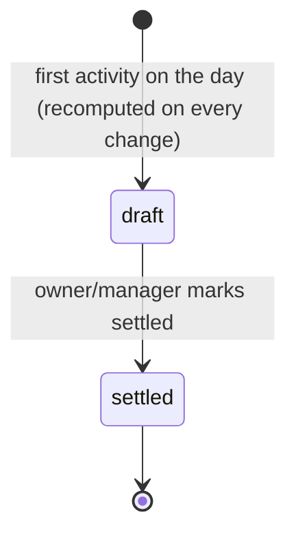

# Collections and settlement

## Collections

When a trip ends, the driver logs what the customer paid. A trip can have several rows, for example part cash and part UPI.

| Field          | Notes                                      |
| -------------- | ------------------------------------------ |
| `method`       | `cash` \| `upi` \| `card`                  |
| `amount_paise` | ≥ 0                                        |
| `reference`    | Optional UPI reference or card slip number |

Online payments (UPI/card) are assumed to go **straight to the owner's account**. Cash stays with the driver until settlement.

## Daily settlement

One settlement per driver per **IST business date**. A trip belongs to the IST date it **ended**, or for an approved cancellation, the date it was **cancelled**. A fuel fill belongs to the IST date of `filled_at`.

| Field                             | Formula                                                                                       |
| --------------------------------- | --------------------------------------------------------------------------------------------- |
| `expected_fare`                   | Σ (quoted fare, or cancellation fare, + non-voided charges) over that day's trips             |
| `cash`                            | Σ cash collections on those trips                                                             |
| `online`                          | Σ UPI/card collections on those trips                                                         |
| `driver_expenses`                 | Σ fuel fills with `paid_by = driver_cash` that day, plus charges with `paid_by_driver = true` |
| `driver_earnings`                 | From the driver's [pay rule](#driver-pay-rules)                                               |
| `carried_adjustment`              | Net of items that synced after an earlier day was already settled                             |
| **`net_payable`**                 | `cash − driver_expenses − driver_earnings + carried_adjustment`                               |
| `shortfall` (derived, shown only) | `expected_fare − (cash + online)`                                                             |

`net_payable > 0` means the driver hands that much to the owner. `net_payable < 0` means the owner pays the driver.

The calculation is a pure function, `computeSettlement(input): SettlementResult`, in `libs/domain/settlement`.

## Driver pay rules

Decision D3: pay is **configurable**. The org sets a default in **Settings → Driver pay** (`org_settings.driver_pay_rule`), and any driver can have an override (`drivers.pay_rule`). Rules are a Zod-validated discriminated union:

| `kind`            | Parameters                                | Daily earnings                                                      |
| ----------------- | ----------------------------------------- | ------------------------------------------------------------------- |
| `none`            | —                                         | 0 (salaried drivers paid outside Taxcy)                             |
| `percent_of_fare` | `percent`, `base: 'quoted' \| 'expected'` | percent × Σ quoted fares (or expected fares, which include charges) |
| `per_trip`        | `amountPaise`                             | amount × trips that day                                             |
| `per_km`          | `paisePerKm`                              | rate × Σ odometer km of the day's trips                             |
| `fixed_daily`     | `amountPaise`                             | amount, if the driver had at least one trip that day                |

All rules also take `allowanceToDriver: boolean` (default `true`). When it's true, `driver_allowance` charges are added to the driver's earnings, because the customer pays the bata for the driver.

The rule in force is snapshotted onto the settlement when it's marked settled, so changing a rule later never rewrites history.

### Worked example

Driver Ramesh, 9 Oct, pay rule = `{ kind: 'percent_of_fare', percent: 20, base: 'quoted', allowanceToDriver: true }`.

| Item                                  | Amount                   |
| ------------------------------------- | ------------------------ |
| Trip A quoted fare                    | ₹3,500                   |
| Trip A toll (`paid_by_driver = true`) | ₹250                     |
| Trip B quoted fare                    | ₹1,800                   |
| **Expected fare**                     | **₹5,550**               |
| Trip A collections                    | ₹2,000 cash + ₹1,750 UPI |
| Trip B collections                    | ₹1,800 cash              |
| Diesel fill, paid by driver cash      | ₹1,200                   |

- cash = 3,800; online = 1,750; shortfall = 5,550 − 5,550 = **0**
- driver_expenses = 1,200 + 250 = 1,450
- driver_earnings = 20% × (3,500 + 1,800) = 1,060
- **net_payable = 3,800 − 1,450 − 1,060 = ₹1,290**, which Ramesh hands to the owner

## Lifecycle

- While a settlement is `draft`, it's recomputed whenever a trip, collection, charge or fill for that driver and day changes.
- **Mark settled** (owner/manager): in one transaction, the API writes `settlement_lines` for every included item, freezes the totals, and moves the included `ended` trips to `settled` (with trip events).
- A settled day is **never mutated**. A fill or collection that syncs later for that day is included in the next draft as a `carried_adjustment` line that references the original item. `UNIQUE (ref_type, ref_id)` on `settlement_lines` guarantees nothing is counted twice.
