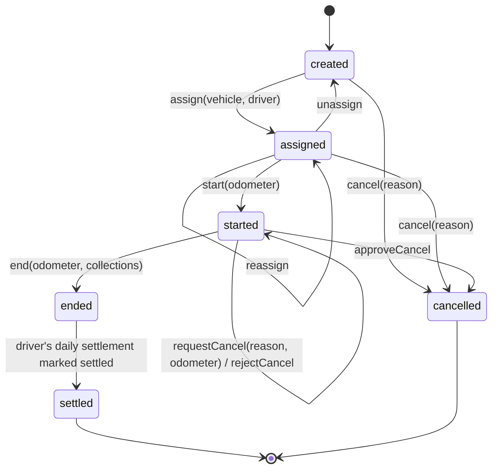

# Trips

## Trip types

| Type | Meaning | `to` required |
| --- | --- | --- |
| `one_way` | A → B; the car returns empty (a future return-leg matching candidate) | yes |
| `round_trip` | A → B → A, usually across several days | yes |
| `local_rental` | Hourly package within a city (for example 8 hr / 80 km) | no |

Each trip has `from` and `to` as text plus an optional PostGIS point, a scheduled window, a quoted fare, and once assigned, a vehicle and a driver.

## State machine



The transition table lives in `libs/domain/trips/state-machine.ts` as pure data plus a `transition(trip, command, actor)` function. The API and the driver app share it, so the app can apply transitions offline.

| Command | From | To | Who | Requires |
| --- | --- | --- | --- | --- |
| `assign` | created | assigned | owner, manager | vehicle + driver free during the window |
| `reassign` | assigned | assigned | owner, manager | as above |
| `unassign` | assigned | created | owner, manager | — |
| `start` | assigned | started | assigned driver, owner, manager | odometer reading (photo + typed km) |
| `end` | started | ended | assigned driver, owner, manager | odometer reading; end km ≥ start km |
| `settle` | ended | settled | system (on settlement) | — |
| `cancel` | created, assigned | cancelled | owner, manager | reason |
| `requestCancel` | started | started (request pending) | assigned driver, owner, manager | reason + end odometer reading |
| `approveCancel` | started (request pending) | cancelled | owner, manager | optional cancellation fare |
| `rejectCancel` | started (request pending) | started | owner, manager | note |
| `withdrawCancel` | started (request pending) | started | requester | — |

Any other transition is rejected with `409 ILLEGAL_TRANSITION` and the body `{ from, command, allowed: [...] }`.

## Trip events

Every successful transition appends one row to `trip_events`, in the same transaction as the trip update:

```json
{
  "id": "0b0f…",                  // command idempotency key
  "trip_id": "…",
  "seq": 3,
  "event_type": "trip.started",
  "from_status": "assigned",
  "to_status": "started",
  "actor_user_id": "…",
  "actor_role": "driver",
  "occurred_at": "2026-10-09T03:12:44Z",   // device clock
  "recorded_at": "2026-10-09T03:40:02Z",   // server clock (synced late)
  "payload": { "odometer_reading_id": "…", "typed_km": 48210 }
}
```

`seq` is assigned under the trip row lock. `trips.version` is used for optimistic locking, so two concurrent transitions can't both succeed.

## Cancelling a started trip

Decision D5: a trip that has started can only be cancelled with a **reason** and an **approval**.

1. The driver (or an owner/manager on their behalf) files a `trip_cancellation_request` with a reason and an end odometer reading. A `trip.cancellation_requested` event is logged and the owner gets an alert.
2. The trip stays `started`; GPS keeps recording until the decision. Only one request can be pending per trip.
3. An owner or manager **approves** it, optionally setting a **cancellation fare** (for example a partial charge for distance already driven), or **rejects** it with a note. On approval the trip becomes `cancelled`, the end odometer is attached, and the odometer-vs-GPS check runs as if the trip had ended.
4. A cancelled-after-start trip appears in the driver's settlement for the IST date of approval. Its expected fare is the cancellation fare plus charges.

Who approves when the requester is an owner? An owner's own request is approved by that owner in the same action, but it still records the reason and odometer.

## Odometer evidence

Start and end each need an `odometer_reading`: a photo taken with the in-app camera plus the km the driver typed in. Then:

1. The worker runs OCR on the photo and stores `ocr_km` next to `typed_km`.
2. If the two differ by more than 1 km, or OCR couldn't read the photo, a `review_item` (`ocr_mismatch_odometer`) is created. **The driver is never blocked.**
3. A start reading lower than the vehicle's last known odometer creates an `odometer_regression` review item.
4. On `end`, the trip's odometer distance (`end_km − start_km`) feeds the [odometer-vs-GPS check](telemetry.md).

## Charges

Decision D2: charges are entered by **the driver** (during or at the end of the trip, in the app) **or an owner/manager** (in the admin web, at any time before the day is settled). Each charge records:

- `kind`: toll, parking, state tax, driver allowance, night charge, extra km, or other
- `amount_paise` and an optional receipt photo
- `paid_by_driver`: whether the driver paid it out of pocket. If so, it's reimbursed in settlement.
- `entered_by` / `entered_role`: who entered it

An owner or manager can void any charge before settlement; the void is recorded as a trip event. **Expected fare** = `quoted_fare_paise` (or `cancellation_fare_paise` for an approved cancellation) + Σ non-voided charges.

## Conflict rules (offline sync)

| Situation | Outcome |
| --- | --- |
| The same `start` command is sent twice | The second call returns the original response |
| The server cancelled the trip, then a `start` arrives from an offline device | `409 TRIP_CANCELLED`. The app marks the trip cancelled and shows "This trip was cancelled by <name> at <time>". The odometer photo is still uploaded and filed as `orphan_evidence`. |
| The trip was reassigned to another driver, then an old driver's command arrives | `409 TRIP_REASSIGNED`; the app removes the trip from "My trips" |
| A cancellation request was approved, then an offline `end` arrives | `409 TRIP_CANCELLED`; the end odometer and collections are kept as evidence on the cancelled trip |
| `end` arrives before `start` (outbox out of order) | Can't happen, because the app's outbox is strictly FIFO per trip. The server still rejects it as an illegal transition. |
